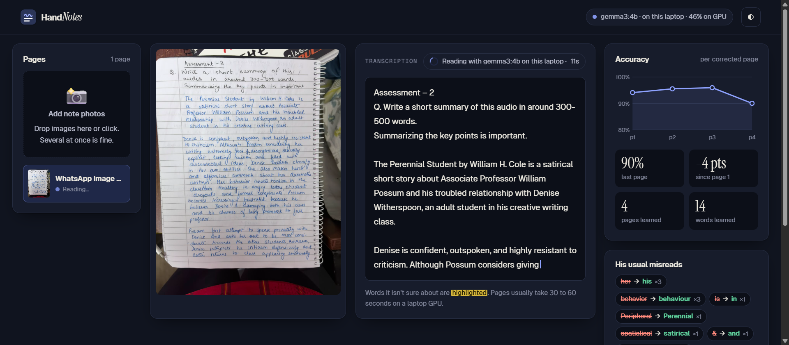
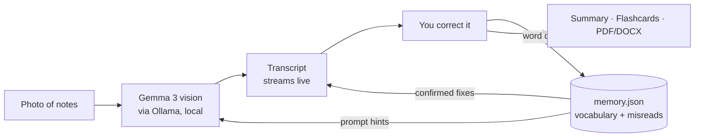
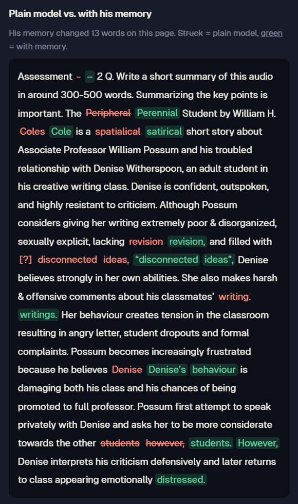
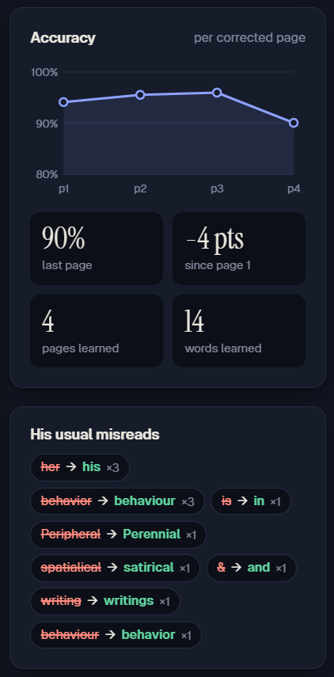

# HandNotes

**A handwriting reader that learns one person's handwriting, running entirely on your own laptop.**

My friend writes down everything in class, then photographs his notes the night before an exam and asks an AI chatbot to summarize them. It can't read his handwriting. And when a model *does* read most of it, the mistakes look right: in our first test a book title turned into a different word, "his" became "her", and a date quietly disappeared.

HandNotes reads his notes with an open vision model (Gemma 3 via Ollama) on his own machine, lets you fix what it got wrong, and remembers those fixes so the next page comes out better. Nothing is uploaded anywhere.

Built for the [DEV Hacktoberfest Weekend Challenge: Build for a Friend](https://dev.to/challenges/hacktoberfest-weekend-2026-10-01).



## Features

- **Live reading**: text streams in word by word as the local model reads the page.
- **Unsure-word highlights**: words the model isn't confident about are marked, and one click jumps to each one in the editor.
- **Correction memory**: every fix is diffed against the model's output and stored. His vocabulary and past misreads are fed into the prompt for the next page, and a misread confirmed twice is corrected automatically.
- **Accuracy tracking**: each saved page records word accuracy, plotted page by page.
- **Before / after**: re-read a page with the plain model and see, word by word, what his memory changed.
- **Whole chapters**: drop or paste several photos; they're read in order.
- **Study tools**: a revision summary with likely exam questions, flip-to-reveal flashcards, and export to PDF, Word or text.
- **Private and offline**: the server binds to `127.0.0.1`, fonts and icons are bundled, and no data leaves the machine.

## How the learning works

HandNotes doesn't retrain a model. It keeps a small per-writer memory (`memory.json`):

1. The model transcribes the page (`handnotes/ocr.py`).
2. You correct the transcript and save.
3. `handnotes/memory.py` diffs the model output against your fix, word by word, and records each misread (`"Peripheral" → "Perennial"`), the words he uses, and the page's accuracy.
4. On the next page, the learned words and misreads are added to the prompt, and misreads confirmed at least twice are replaced automatically. Short, context-dependent words like *his/her* are never auto-replaced.



## Results on his real notes

Four of his pages, read in order with the memory building up, each scored against a transcript checked word by word. Pages 2–4 were also read by the plain model (no memory) for comparison.

| Page | With memory | Plain model |
|---|---|---|
| 1. Literature assessment | 94.1% | (no memory yet) |
| 2. Research overview | 95.5% | 95.5% |
| 3. Formal letter | 96.0% | 95.2% |
| 4. Literature assessment | 90.1% | 91.9% |

What that taught me:

- **The memory fixes names and terms.** Re-reading page 1 with memory, "Peripheral" became "Perennial" and "spatialical" became "satirical".
- **It can also learn the wrong lesson.** He spells "behavior" on one page and "behaviour" on another, so a fix learned on one page made the next one worse, and the memory turned "Coles" into "Cole". Telling his inconsistencies apart from the model's mistakes is the next problem to solve.
- **Pronouns are the stubborn error.** The model keeps turning "his" into "her" despite being told to copy literally.
- **Errors travel.** A word the model invented ("distressed") flowed straight into the generated summary, which is why the review step comes before the study tools.

<p>
  
  
</p>

## Why open matters

- **It can be taught one person.** A closed chatbot can't learn your friend's handwriting. An open model plus a local memory can.
- **His notes stay his.** Photos never leave the laptop: no account, no upload, no third-party server.
- **It works offline and costs nothing.** No subscription, no API bill, so a student will actually keep using it.
- **It's swappable.** Change the model with one environment variable, edit the prompt, or fine-tune later on the corrections it collects.

## Getting started

Requirements: Python 3.11+, [Ollama](https://ollama.com), and about 4 GB of free RAM/VRAM.

```bash
# 1. Get the model
ollama pull gemma3:4b

# 2. Install dependencies
pip install -r requirements.txt

# 3. Run
python server.py
```

Open <http://127.0.0.1:8000> for the landing page, or <http://127.0.0.1:8000/app> for the workspace.

Configuration (optional environment variables):

| Variable | Default | Purpose |
|---|---|---|
| `HANDNOTES_MODEL` | `gemma3:4b` | Any Ollama vision model |
| `OLLAMA_URL` | `http://127.0.0.1:11434` | Where Ollama is running |

On a laptop with a GTX 1650 Ti (4 GB), a page takes about 30–40 seconds, with the model split roughly half on GPU and half on CPU.

## Tests

```bash
python -m pytest
```

29 tests cover the correction memory, the API (with the model mocked), flashcard parsing and the exporters.

## Project structure

```
handnotes/
  memory.py     correction memory: diffing, accuracy, prompt hints, auto-fixes
  ocr.py        Ollama client: streaming transcription, summary, flashcards, status
  exporters.py  PDF and DOCX export
server.py       FastAPI app: API + static UI, bound to 127.0.0.1
static/         landing page, workspace, styles, bundled fonts and icons
tests/          pytest suite
```

## What's next

Not implemented yet:

- **Handwriting library**: locate each corrected word on the page and store the cropped image with its label.
- **Personal model**: fine-tune a small open handwriting model (e.g. TrOCR) on that library, locally, and use it to re-read words the main model is unsure about.
- **Slip vs. misread**: let the user mark a change as "his slip, don't learn" before saving, and flag real words he uses instead of auto-replacing them.

## Credits

- [Gemma 3](https://ai.google.dev/gemma) by Google, served by [Ollama](https://ollama.com)
- [FastAPI](https://fastapi.tiangolo.com), [fpdf2](https://github.com/py-pdf/fpdf2), [python-docx](https://github.com/python-openxml/python-docx)
- Fonts: [Geist](https://vercel.com/font) and [Instrument Serif](https://github.com/Instrument/instrument-serif), both under the SIL Open Font License
- Icons: [Fluent Emoji](https://github.com/microsoft/fluentui-emoji) by Microsoft, MIT License

## License

[MIT](LICENSE)
